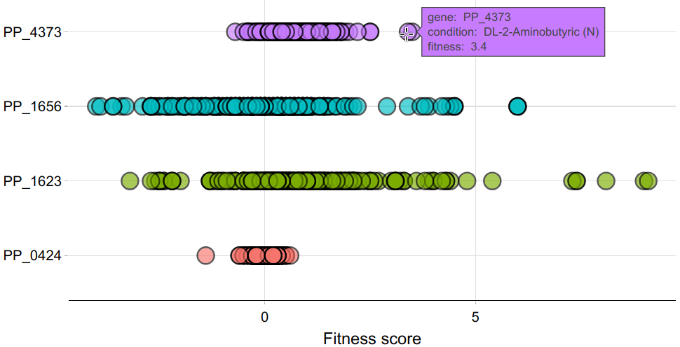

<!-- README.md is generated from README.Rmd. Please edit that file -->

# fitnessbrowseR

<!-- badges: start -->
<!-- badges: end -->

`fitnessbrowseR` is an R package that provides utilities for retrieving
information from the public version of the [fitnessb
browser](https://fit.genomics.lbl.gov/), a database that compiles data
from Random Barcode Transposon-site Sequencing (RB-TnSeq) experiments
for a variety of microbial hosts and conditions. Please, consider
reading the original
[publication](https://mbio.asm.org/content/6/3/e00306-15.full) by
Wetmore and colleagues for more information about the method.

This package is still under development, please report any bug that you
find to me at my [email address](viana.guilherme@proton.me), or create a
pull request.

Thank you for checking `fitnessbrowseR` out!

## Installation

You can install the development version of `fitnessbrowseR` with the
command below:

``` r
devtools::install_github("viana-guilherme/fitnessbrowseR")
```

## Usage

At this time, the package contains a handful of functions that allow
retrieving and visualizing of data from the fitness browser. For
example, imagine that you are interested in understanding the changes in
fitness for mutants of *Pseudomonas putida* strain KT2440 at specific
*loci* (PP_0424, PP_1656, PP_1623, PP_2303, PP_4373), which correspond
to transcriptional regulators of interest.

The first step is obtaining the Fitness Browser organism ID for your
desired strain. This can be done with the function `getOrganismCodes()`.
Below, we’re using the filter parameter to narrow the results to only
organisms containing “Pseudomonas” in their names (leave this parameter
blank to check all available organisms in the database).

``` r
library(fitnessbrowseR)

# prints organism codes for "Pseudomonas" available in the database
getOrganismCodes(filter = "Pseudomonas")
#> # A tibble: 10 × 2
#>    Organism                                      OrgID                  
#>    <chr>                                         <chr>                  
#>  1 Pseudomonas fluorescens FW300-N1B4            pseudo1_N1B4           
#>  2 Pseudomonas fluorescens FW300-N2C3            pseudo5_N2C3_1         
#>  3 Pseudomonas fluorescens FW300-N2E2            pseudo6_N2E2           
#>  4 Pseudomonas fluorescens FW300-N2E3            pseudo3_N2E3           
#>  5 Pseudomonas fluorescens GW456-L13             pseudo13_GW456_L13     
#>  6 Pseudomonas putida KT2440                     Putida                 
#>  7 Pseudomonas simiae WCS417                     WCS417                 
#>  8 Pseudomonas stutzeri RCH2                     psRCH2                 
#>  9 Pseudomonas syringae pv. syringae B728a       SyringaeB728a          
#> 10 Pseudomonas syringae pv. syringae B728a ΔmexB SyringaeB728a_mexBdelta
```

We can see that “Putida” is the organism code for KT2440 in the fitness
browser database. We can now proceed to searching the fitness values for
our genes of interest in all available conditions for *P. putida*
KT2440.

*Note: please keep in mind that R is case sensitive!*

``` r

# defines a vector with the genes of interest
# (this keeps the script more organized)
genes_of_interest <- c("PP_0424", "PP_1656", "PP_1623", "PP_2303", "PP_4373")

# searches fitness data for the genes of interest in all available conditions for P. putida KT2440
fitness_results <- searchFitnessBrowser(gene = genes_of_interest, OrgID = "Putida")
#> retrieving fitness data for PP_0424
#> retrieving fitness data for PP_1656
#> retrieving fitness data for PP_1623
#> retrieving fitness data for PP_2303
#> PP_2303 data not found in database
#> retrieving fitness data for PP_4373

dim(fitness_results)
#> [1] 1200    5
```

We now have queried the fitness browser for all of the genes of interest
that were provided. Note that PP_2303 was not found in the database,
which can happen eventually. In such cases, the R console will let you
know that data was not found for that gene, but this will not throw an
error and this gene will simply be ignored. The function will run as
normal, and return a table containing data for all of the valid genes.

In this example, the resulting table is 1200 lines long, and contains
five columns (which are always: group, condition, fitness, ‘t score’ and
gene). We can use any R function for exploring and processing the
resulting data frame further. Alternatively, the function
`visualizeFitness()` provides a quick way to identify conditions of
interest with an interactive plot. To use this function, we simply pass
the table we obtained from `searchFitnessBrowser()` as an argument.

``` r

# generates a simple scatter plot for fitness data across every gene
# Set interactive to TRUE to be able to check the conditions by hovering the points
# 
visualizeFitness(fitness_results, interactive = TRUE)
```


